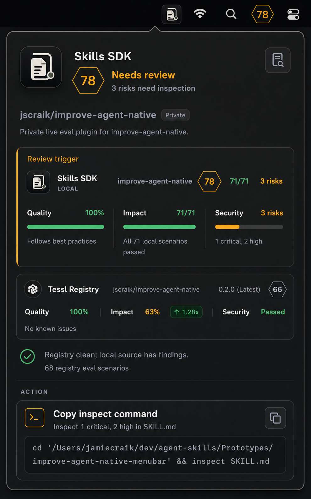
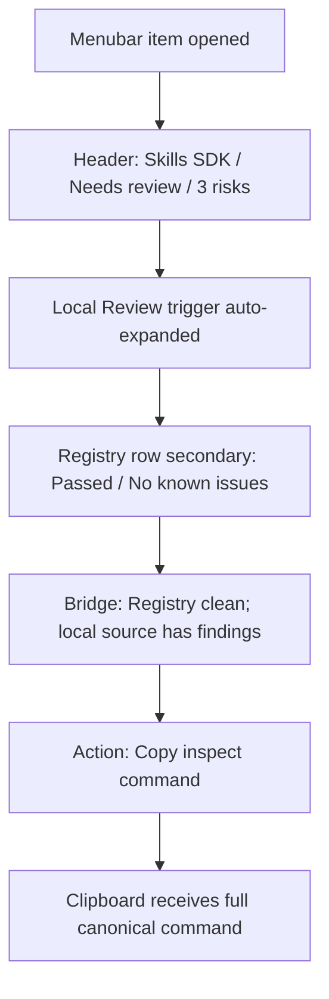

## Command Summary

BLUF: This document specifies the Skills SDK menubar review popover that should be implemented from the persisted mockup, including its visible content, source-status hierarchy, copy-command behavior, accessibility requirements, proof boundary, and acceptance IDs. It covers a compact diagnostic surface where the local review trigger is expanded by default, the Tessl Registry row stays secondary, and one neutral Copy inspect command action carries the operator to the next step. This matters because a developer can see a clean registry package and still receive a review warning unless the UI clearly explains that the local source is the active problem. The implementation decision is to preserve the mockup's source-status story and color semantics: amber diagnoses review risk, green confirms clean or passed evidence, and neutral graphite carries the action. The work must not close until the canonical inspect command, icon size variants, live popover height, keyboard focus, reduced motion, and clipboard behavior are proven in the running menubar app, so the next step is implementation planning against SA-001 through SA-010 after the command and icon questions are resolved.

Decision Needed: approve this visual/behavior contract for implementation planning, or revise the open command/icon questions first.

Top Risks:
- Placeholder command syntax could ship and copy a non-existent command, causing users to lose trust in the primary action.
- A single scaled icon asset could blur or crowd at menubar and row sizes, making the product identity feel unfinished.
- The popover could exceed laptop-height constraints if native typography and spacing are not validated in the real menubar app.

Next Action: route to implementation planning only after the exact command string and icon asset variant strategy are confirmed.

## Purpose

Specify the final mockup direction for the Skills SDK menubar review popover as a testable UI contract. The spec covers visible hierarchy, source comparison, interaction states, copy behavior, icon variants, accessibility, validation, and proof boundaries for the approved slice.

## Problem Statement

When a local Skills SDK source has review findings while the Tessl Registry package is clean, the menubar must explain the split without making the user hunt through collapsed rows or infer which source owns the warning. The surface must make the local review trigger obvious, keep registry status as supporting evidence, and provide one trustworthy next action.

## User / Operator Scenarios

1. A developer opens the Skills SDK menubar while the package is in Needs review state and sees why the warning exists.
2. A developer compares local Skills SDK evidence against Tessl Registry evidence and understands that registry is clean while local source has findings.
3. A developer copies the inspect command and expects the full command, not the visually wrapped or truncated command fragment, to be placed on the clipboard.
4. A keyboard-only user reaches the details and copy controls with visible focus and equivalent semantics.
5. A reduced-motion user opens the popover without transform-heavy animation or row reveal motion.

## Goals

- Make Needs review and 3 risks need inspection the primary status narrative.
- Auto-expand the local Review trigger evidence row when review state is active.
- Keep Tessl Registry evidence secondary and visually quieter than the local review trigger.
- Keep the copy action neutral and remedial, not warning-colored.
- Preserve a compact native macOS utility feel within realistic menubar constraints.
- Define validation that separates generated mockup acceptance from implementation proof.

## Non-Goals

- Do not specify the entire menubar app architecture.
- Do not change registry scoring semantics, Tessl data contracts, or local review computation.
- Do not invent the production CLI command; the mockup command is a placeholder until implementation confirms the canonical command.
- Do not add a collapsed accordion model for review findings.
- Do not treat generated image fidelity as proof that the live app matches the spec.

## Current State / Evidence

| Evidence | Status | Notes |
| --- | --- | --- |
| User-approved iterative mockups | available | User repeatedly requested mockup refinement and critique. |
| Persisted final mockup | available | .harness/media/2026-07-09-skills-sdk-menubar-final-mockup.png |
| Actual Skills SDK icon reference | available in chat context | Used to guide icon concept; production assets still need variant exports. |
| Live menubar implementation | not checked | No runtime app launch or screenshot validation was run for this spec. |
| Canonical inspect command | unresolved | Must be confirmed before implementation. |

## Authority and Scope Boundary

requested_depth: approved_slice

approved_execution_boundary: The user approved creating another mockup and a spec for this selected popover direction. This spec may write local .harness artifacts but does not approve product-code implementation, commits, PRs, or external tracker mutation.

downscope_authority: explicit_user_approval for this spec-only slice. Full implementation remains outside this artifact.

external_mutation_boundary: none. No Linear, GitHub, deployment, or production mutation is authorized by this spec.

freshness_required: validation_time for any later implementation proof. Runtime screenshots, accessibility checks, and clipboard tests must be fresh in the implementation closeout window.

human_acceptance_boundary: required. Jamie should accept or revise the spec before it drives implementation.

## Proposed Behavior

### User-Facing Solution

The menu gives the operator a clear next move when the local skill needs review. On open, the developer sees that the current package is Needs review, that the local Skills SDK source is the review trigger, that Tessl Registry remains clean, and that copying the inspect command is the correct next action. The result is a popover that reduces source-status confusion and lets the operator move from diagnosis to inspection without opening another surface first.

### Visual Reference

The persisted visual reference is review guidance for hierarchy, density, and semantics:

Prose requirements and acceptance IDs are authoritative if the image conflicts with this spec.

## Requirements

### Functional Requirements

- FR-001: The popover MUST show the product title Skills SDK, score 78, status Needs review, and substatus 3 risks need inspection in the header.
- FR-002: The package identity MUST show jscraik/improve-agent-native, a Private pill, and Private live eval plugin for improve-agent-native.
- FR-003: When review state is active, the local Skills SDK source card MUST be auto-expanded and MUST NOT require a user accordion or chevron interaction to expose risk evidence.
- FR-004: The local source card MUST show Review trigger, Skills SDK, LOCAL, improve-agent-native, score 78, impact 71/71, and security 3 risks.
- FR-005: The local metrics MUST show Quality 100% / Follows best practices, Impact 71/71 / All 71 local scenarios passed, and Security 3 risks / 1 critical, 2 high.
- FR-006: The Tessl Registry row MUST be visually secondary and show Tessl Registry, jscraik/improve-agent-native, 0.2.0 (Latest), score 66, Quality 100%, Impact 63%, ↑ 1.28x, Security Passed, and No known issues.
- FR-007: The bridge line MUST state Registry clean; local source has findings. and 68 registry eval scenarios.
- FR-008: The action block MUST show Copy inspect command and Inspect 1 critical, 2 high in SKILL.md.
- FR-009: The copy control MUST copy the full canonical command string, regardless of visual wrapping or truncation in the command field.
- FR-010: The command visible in the final implementation MUST use the confirmed canonical command shape. The mockup placeholder command MUST NOT ship if inspect SKILL.md is not a real supported command.
- FR-011: The top-right details icon MUST open details or inspection context if implemented; it MUST NOT duplicate the command copy action.

### Non-Functional Requirements

- NFR-001: The popover SHOULD fit within a laptop-height menubar window without clipping primary content.
- NFR-002: The resting layout MUST NOT include instructional helper copy such as Copies the full command to clipboard.
- NFR-003: The visual hierarchy MUST keep Needs review, Review trigger, the bridge line, and Copy inspect command ahead of package metadata.
- NFR-004: Amber MUST be reserved for review/risk semantics, except for the small terminal icon accent.
- NFR-005: Green MUST be reserved for pass/clean/success semantics.
- NFR-006: Neutral graphite containers MUST be used for cards and actions; the action card MUST NOT use an amber diagnostic rail.

## Interfaces

| Interface | Contract |
| --- | --- |
| Menubar trigger | Opens the Skills SDK popover anchored to the menu item. |
| Details button | Icon-only control with accessible name Open review details; neutral resting state and lavender-blue focus state. |
| Copy button | Icon-only control with accessible name Copy inspect command; copies full canonical command and gives post-click feedback. |
| Command field | Displays wrapped/truncated monospace command text; accessible value exposes the full command string. |

## Data / Domain Contract

| Field | Required Value for This State | Source/Notes |
| --- | --- | --- |
| status | Needs review | Local review state. |
| headline_score | 78 | Header and local card score. |
| local_quality | 100% | Local Skills SDK metric. |
| local_impact | 71/71 | MUST pair with All 71 local scenarios passed. |
| local_security | 3 risks | Risk detail: 1 critical, 2 high. |
| registry_score | 66 | Dim secondary score. |
| registry_impact | 63% with ↑ 1.28x | Registry metric. |
| registry_security | Passed | Registry clean status. |
| registry_eval_count | 68 registry eval scenarios | Bridge/supporting evidence. |

## Enforcement Contract

essential_decisions:
- Review state automatically expands the local review trigger card.
- Registry evidence remains secondary to local review evidence.
- The copied command must be canonical and complete.
- Icon assets require separate optical variants for menubar, header, and source row.

fillable_gaps:
- Exact native spacing tokens may be tuned during SwiftUI/AppKit implementation.
- Details-button destination may be wired to the existing details surface once confirmed.
- Tooltip/help copy may exist on hover/focus if it does not appear in resting state.

guardrails:
- Screenshot comparison against .harness/media/2026-07-09-skills-sdk-menubar-final-mockup.png.
- Clipboard test proving the full command is copied.
- Keyboard traversal test covering details and copy controls.
- Reduced-motion check for popover open and state changes.
- Height check at target laptop viewport.

refusal_triggers:
- Canonical command is unknown or unsupported.
- Local/registry data contracts disagree with displayed values.
- Implementation needs a new public API, storage contract, or security boundary not covered here.
- Icon assets are unavailable and scaling one detailed asset causes illegible menubar/row icons.

durable_memory:
- Transferable design decisions should be recorded in this spec and, if implemented, in any repo-local design notes for the menubar prototype.

professional_output:
- Closeout must include changed files, exact validation commands, pass/fail/blocked outcomes, screenshot or runtime evidence paths, warnings, and remaining blockers.

## Proof and Runtime Boundary

proof_boundary: Completion is proven only by the live menubar app rendering the specified state and passing clipboard, focus, reduced-motion, and height checks.

non_proof_sources:
- Generated image alone.
- Chat critique.
- Cached screenshot without current app run.
- Prior mockup iterations.

runtime_state: Spec-only. No implementation runtime was launched in this spec turn.

runtime_invocation_receipt: blocked - no workflow-closeout receipt generated in this mockup/spec turn.

artifact_chain_key: skills-sdk-menubar-review-popover

resumption_key: .harness/specs/2026-07-09-skills-sdk-menubar-review-popover-spec.md

persistent_artifacts:
- .harness/specs/2026-07-09-skills-sdk-menubar-review-popover-spec.md
- .harness/media/2026-07-09-skills-sdk-menubar-final-mockup.png

live_state_refresh: required before implementation closeout.

session_evidence_status: historical/supporting only.

## Coding and Testing Lenses

coding_lens:
- ownership: Skills SDK menubar prototype UI and related icon/action-state surfaces.
- allowed_surfaces: popover layout, card components, icon asset mapping, copy action, keyboard/focus states, reduced-motion behavior.
- forbidden_surfaces: registry scoring logic, local review computation, Tessl publishing semantics, external tracker mutation, unrelated app navigation.
- compatibility: keep data labels and command behavior compatible with existing source models; do not invent unsupported CLI syntax.
- complexity_posture: prefer existing native components/tokens/patterns before new abstractions.

testing_lens:
- observable_behavior: rendered popover state, auto-expanded review trigger, secondary registry row, full command copy, focus traversal, reduced-motion parity, height fit.
- acceptance_source: SA-001 through SA-010 below.
- positive_scenarios: active review state, registry clean/local findings, copy succeeds.
- negative_scenarios: missing canonical command, clipboard failure, small viewport clipping, contrast/focus failure.
- exact_validation_commands: to be selected by implementation plan from the menubar repo scripts and app runtime; this spec does not assert available commands.
- blocked_gates: live runtime validation is blocked until implementation exists or current prototype is launched against this spec.

## Security, Privacy, and Safety

- The command field MUST NOT expose secrets, tokens, raw transcripts, or private telemetry.
- Local absolute paths may appear in the operator command for this local menubar prototype, but PR-bound artifacts MUST NOT treat machine-local paths as portable proof.
- Copy behavior MUST be explicit and limited to the inspect command, not hidden shell side effects.
- The popover MUST NOT imply registry safety proves local source safety.

## Accessibility and Operator Ergonomics

- Icon-only controls MUST have accessible names.
- Focus state MUST be visible and MUST use lavender-blue or another non-amber focus token.
- Status MUST NOT rely on color alone; text labels such as Needs review, 3 risks, Passed, and Registry clean; local source has findings. are required.
- Reduced-motion users MUST NOT receive transform-heavy popover or row-reveal motion.
- Small grey labels and dim registry badge MUST pass contrast checks in the real implementation.
- The command field MUST expose the full command to assistive technology even if visual text wraps or truncates.

## Failure and Recovery

| Failure | Required Recovery |
| --- | --- |
| Canonical command unresolved | Block implementation handoff until command owner confirms exact string. |
| Popover clips on laptop height | Tighten vertical gaps or add internal scrolling while keeping status, local trigger, bridge line, and action visible. |
| Copy action copies truncated text | Fail validation and bind copy source to command model instead of rendered text. |
| Icon illegible at small size | Export simplified optical-size asset variant. |
| Registry/local state appears contradictory | Preserve bridge line and source labels; do not hide the local trigger. |

## Validation Plan

| Gate | Command / Evidence | Expected Outcome |
| --- | --- | --- |
| V-001 visual target exists | test -f .harness/media/2026-07-09-skills-sdk-menubar-final-mockup.png | pass |
| V-002 spec shape | check_generated_artifact_shape.py with this spec path and kind spec | pass or documented blocker |
| V-003 BLUF shape | check_bluf_structure.py with this spec path | pass or documented blocker |
| V-004 runtime visual comparison | Implementation-run screenshot compared with persisted mockup | blocked until implementation/run exists |
| V-005 clipboard behavior | Copy action places full canonical command on clipboard | blocked until implementation/run exists |
| V-006 accessibility/focus | Keyboard focus order and accessible names checked in app | blocked until implementation/run exists |
| V-007 reduced motion | Reduced-motion setting removes transform-heavy motion | blocked until implementation/run exists |
| V-008 height fit | Popover fits target laptop screen constraints | blocked until implementation/run exists |

## Acceptance Criteria

- SA-001: In active review state, the popover shows Needs review, score 78, and 3 risks need inspection.
- SA-002: The local Review trigger card is expanded by default and has no chevron or accordion affordance.
- SA-003: The local card displays quality, impact, and security values exactly as specified in FR-004 and FR-005.
- SA-004: The Tessl Registry row is visually secondary and displays registry values exactly as specified in FR-006.
- SA-005: The bridge line explicitly explains Registry clean; local source has findings.
- SA-006: The action block is neutral-first and has no amber diagnostic rail.
- SA-007: The copy button copies the full canonical command, not the wrapped/truncated visible text.
- SA-008: Details and copy icon controls have accessible names and visible keyboard focus.
- SA-009: Reduced-motion mode preserves usability and removes unnecessary transform motion.
- SA-010: The rendered popover fits target menubar window constraints without hiding status, local trigger, bridge line, or copy action.

## Visual References / Diagrams

### Persisted Mockup

- Repository media path: .harness/media/2026-07-09-skills-sdk-menubar-final-mockup.png
- Purpose: visual target for hierarchy, density, icon treatment, color semantics, and resting-state layout.
- Source prompt: generated in the Codex image workflow from the latest review feedback on 2026-07-09.
- Closure evidence status: review-only visual target; not implementation proof.
- File existence verification: see validation evidence in closeout.

### State Flow

## Implementation Notes

- Treat the mockup command as a placeholder until the canonical production command is confirmed.
- Use separate icon variants for menubar, header, and row sizes.
- The copy action should source from a command model, not the rendered text node.
- The details icon should not duplicate copy behavior.
- Keep tooltip/helper text out of resting state; hover/focus help MAY be added if implementation evidence shows ambiguity remains.
- If height is tight, compress package identity and card gaps before removing the bridge line or action.

## Open Questions

1. What is the exact canonical inspect command that should be copied?
2. What details surface should the top-right inspect/details icon open?
3. What exact laptop viewport/window height should be the acceptance target?
4. Are the Skills SDK icon variants already available as source assets, or must implementation create/export them?

## Decision

Adopt the persisted mockup as the implementation visual target for the selected slice, with the command string and icon asset variants treated as blocking confirmations before implementation closeout.

## Evidence and References

- Generated visual target: .harness/media/2026-07-09-skills-sdk-menubar-final-mockup.png
- Source image cache: /Users/jamiecraik/.codex/generated_images/019f465c-e19a-7b32-b965-35c151c4e950/ig_09dbb15fc7d0c4a4016a4f976b67c081919561d67f7bbd5e29.png
- User-provided HE spec skill instructions in this turn.
- HE references read before drafting:
  - references/skills/he-spec/spec-mode-rules.md
  - references/skills/he-spec/spec-artifact-contract.md
  - references/spec-plan-runtime-boundary-contract.md
  - references/stage-arc-boundary-contract.md
  - references/visual-reference-contract.md
  - references/bluf-review-contract.md

## Appendix A. Harness Metadata / Traceability

interactive_status: completed_without_user_clarification

selection_evidence: user requested final mockup feedback to be used for another ImageGen pass and asked for harness-engineering:he-spec spec creation.

route: harness-engineering:he-spec

stage: he-spec

scope: approved UI spec slice for Skills SDK menubar review popover.

safe_to_continue: true for implementation planning after open questions are resolved; false for implementation closeout until runtime proof exists.

blocked_reason: not_applicable for spec drafting; implementation proof blocked until app run and canonical command are available.

spec_path: .harness/specs/2026-07-09-skills-sdk-menubar-review-popover-spec.md

acceptance_ids: SA-001, SA-002, SA-003, SA-004, SA-005, SA-006, SA-007, SA-008, SA-009, SA-010

authority_scope_boundary: local spec and media artifact writes only; no product code, tracker, commit, push, or deployment authority.

proof_runtime_boundary: generated media is review-only; live menubar app proof is required for completion claims.

git_staging_status: not_staged

staged_paths: []

linear_mutation_status: not_needed

linear_action_required: not_applicable

confidence: medium; grounded in persisted mockup and user-approved iteration, limited by unresolved canonical command and absence of runtime validation.

stage_arc_boundary:
  left_arc:
    source_of_truth: User-approved mockup iteration and generated visual target
    entry_authority: explicit
    freshness_required: allowed_stale for visual iteration, fresh required for implementation proof
    not_proof: Generated image and chat critique do not prove live app behavior.
  active_arc:
    owned_stage: he-spec
    allowed_actions: generate mockup, persist local media, write local spec artifact
    forbidden_actions: product code edit, external tracker mutation, commit, push, deployment, closure claim
    mutation_boundary: local_artifact
  right_arc:
    handoff_target: he-plan
    handoff_artifact: .harness/specs/2026-07-09-skills-sdk-menubar-review-popover-spec.md
    proof_required: canonical command confirmation, live menubar screenshot, clipboard/focus/reduced-motion/height validation
    closure_boundary: not_closure
    resume_key: skills-sdk-menubar-review-popover
  persona_lenses:
    coding_lens: required
    testing_lens: required
    coverage_parity_required: yes

## Appendix B. Review Outcomes

- Interface review outcome: layout story is stable; avoid further broad exploration unless runtime constraints invalidate it.
- Design engineering outcome: neutral action semantics and icon optical variants are required for polish.
- UI/UX creative coding outcome: interaction scope should stay limited to details, copy, focus, reduced motion, and height fit.
- Product design outcome: local-vs-registry distinction is the core user story and must remain explicit.

## Appendix C. he-plan Handoff

Handoff target: harness-engineering:he-plan after Jamie accepts this spec or revises open questions.

Required plan inputs:
- this spec path
- persisted mockup path
- canonical inspect command
- target implementation repo/path
- actual menubar app runtime command
- icon source asset locations
- validation commands available in the menubar prototype

No-Fog Gate:
- One opening BLUF exists in Command Summary.
- Requirements have stable IDs.
- Acceptance criteria have stable SA-* IDs.
- Proof boundary separates generated visual target from runtime proof.
- Open questions name blocking implementation uncertainties.
- Validation commands are marked blocked where runtime implementation is not available.
