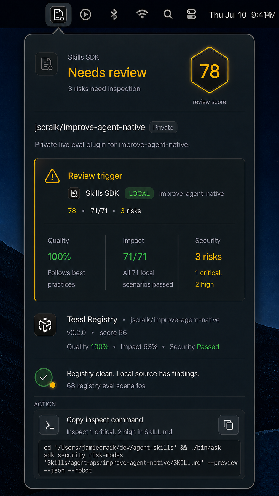
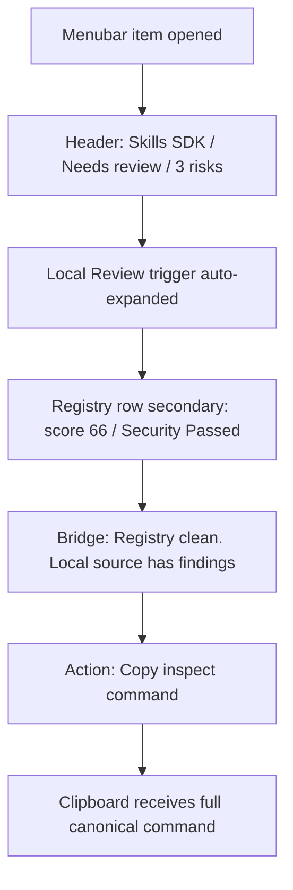

## Command Summary

BLUF: This document specifies the implementation handoff for the Skills SDK macOS menubar review popover. It locks a tall `404 x 720 pt` MenuBarExtra surface where the local review trigger is expanded, Tessl Registry stays secondary, the mixed-status bridge explains the registry/local split, and one neutral Copy inspect command moves the operator forward. The canonical command is the proven JSON/robot `risk-modes` preview command, the unowned details control is omitted, and separate menubar, header, and row icon treatments are derived from the existing source assets. These decisions prevent a clean registry package from obscuring local findings or sending the operator into an ambiguous action. Generated media remains review guidance rather than runtime proof, so implementation closeout still requires a fresh live screenshot, clipboard equality, keyboard focus, reduced-motion classification, and height-fit evidence.

Decision Needed: none for this selected implementation slice; route the locked contract to implementation planning.

Top Risks:
- The implementation could accidentally preserve the current multi-route action behavior instead of binding every review action surface to `reviewInspectCommand`.
- A single scaled bitmap could blur or crowd at menubar and row sizes unless implementation creates the specified optical treatments.
- The `404 x 720 pt` baseline could clip under larger accessibility text or a smaller visible screen frame unless live height and overflow behavior are checked.

Next Action: route this spec and the implementation-handoff mockup to implementation planning; keep runtime proof gates blocked until the real MenuBarExtra is exercised.

## Purpose

Specify the final mockup direction for the Skills SDK menubar review popover as a testable UI contract. The spec covers visible hierarchy, source comparison, interaction states, copy behavior, icon variants, accessibility, validation, and proof boundaries for the approved slice.

## Problem Statement

When a local Skills SDK source has review findings while the Tessl Registry package is clean, the menubar must explain the split without making the user hunt through collapsed rows or infer which source owns the warning. The surface must make the local review trigger obvious, keep registry status as supporting evidence, and provide one trustworthy next action.

## User / Operator Scenarios

1. A developer opens the Skills SDK menubar while the package is in Needs review state and sees why the warning exists.
2. A developer compares local Skills SDK evidence against Tessl Registry evidence and understands that registry is clean while local source has findings.
3. A developer copies the inspect command and expects the full command, not the visually wrapped or truncated command fragment, to be placed on the clipboard.
4. A keyboard-only user reaches the copy control with visible focus and equivalent semantics.
5. A reduced-motion user opens the popover without transform-heavy animation or row reveal motion.

## Goals

- Make Needs review and 3 risks need inspection the primary status narrative.
- Auto-expand the local Review trigger evidence row when review state is active.
- Keep Tessl Registry evidence secondary and visually quieter than the local review trigger.
- Keep the copy action neutral and remedial, not warning-colored.
- Preserve a tall but native macOS utility feel within realistic menubar constraints.
- Define validation that separates generated mockup acceptance from implementation proof.

## Non-Goals

- Do not specify the entire menubar app architecture.
- Do not change registry scoring semantics, Tessl data contracts, or local review computation.
- Do not substitute a shorter silent command, Terminal launch, Tessl navigation, or recovery action for the canonical copy command.
- Do not add a collapsed accordion model for review findings.
- Do not treat generated image fidelity as proof that the live app matches the spec.

## Current State / Evidence

| Evidence | Status | Notes |
| --- | --- | --- |
| User-approved iterative mockups | available | User repeatedly requested mockup refinement and critique. |
| Persisted final mockup | available | .harness/media/2026-07-09-skills-sdk-menubar-final-mockup.png |
| Persisted final-polish mockup | historical visual | .harness/media/2026-07-09-skills-sdk-menubar-review-popover-final-polish.png |
| Implementation-handoff mockup | available | .harness/media/2026-07-09-skills-sdk-menubar-review-popover-implementation-handoff.png |
| Implementation-handoff prompt sidecar | available | .harness/media/2026-07-09-skills-sdk-menubar-review-popover-implementation-handoff.prompt.md |
| Three-lane review synthesis | available | .harness/reviews/2026-07-09-review-popover-3lane-synthesis.md |
| Pass-three review synthesis | available | .harness/reviews/2026-07-09-review-popover-pass3-synthesis.md |
| Skills SDK and Tessl icon sources | available in repository | `Sources/SkillsBar/Resources/SkillsSDKIcon.png` and `Sources/SkillsBar/Resources/TesslLogo.png`; implementation must create optical treatments rather than scaling one bitmap unchanged. |
| Live menubar implementation | blocked | Product code and deterministic snapshot exist, but `script/build_and_run.sh --verify` cannot open the app from the Codex process because LaunchServices returns `kLSNoExecutableErr`. |
| Canonical inspect command | confirmed | `./bin/ask sdk security risk-modes 'Skills/agent-ops/improve-agent-native/SKILL.md' --preview --json --robot` returned the expected three detected risks and a no-mutation preview receipt. |
| Snapshot fixture seam in current implementation | implemented | `DashboardDataSource` selects `SKILLSBAR_REVIEW_FIXTURE=1` before live loading, and `SnapshotRenderer` uses that source through an `NSHostingView` render. |

## Authority and Scope Boundary

requested_depth: approved_slice

approved_execution_boundary: The user approved creating another mockup and a spec for this selected popover direction. This spec may write local .harness artifacts but does not approve product-code implementation, commits, PRs, or external tracker mutation.

downscope_authority: explicit_user_approval for this spec-only slice. Full implementation remains outside this artifact.

external_mutation_boundary: none. No Linear, GitHub, deployment, or production mutation is authorized by this spec.

freshness_required: validation_time for any later implementation proof. Runtime screenshots, accessibility checks, and clipboard tests must be fresh in the implementation closeout window.

human_acceptance_boundary: required. Jamie should accept or revise the spec before it drives implementation.

menu_bar_boundary: This surface is a macOS MenuBarExtra(.window) popover. The implementation MUST preserve the menu-bar-extra app shell and MUST NOT replace this slice with a normal WindowGroup, NavigationSplitView, document window, sidebar, or standalone app-window architecture.

## Proposed Behavior

### User-Facing Solution

The menu gives the operator a clear next move when the local skill needs review. On open, the developer sees that the current package is Needs review, that the local Skills SDK source is the review trigger, that Tessl Registry remains clean, and that copying the inspect command is the correct next action. The result is a popover that reduces source-status confusion and lets the operator move from diagnosis to inspection without opening another surface first.

### Visual Reference

The persisted implementation-handoff visual reference is review guidance for hierarchy, density, icon treatment, material weight, and source-status semantics:

Prose requirements and acceptance IDs are authoritative if the image conflicts with this spec.

## Requirements

### Functional Requirements

- FR-001: The popover MUST show the product title Skills SDK, status Needs review, substatus 3 risks need inspection, and a Tessl-style hex score 78 in the header.
- FR-002: The package identity MUST show jscraik/improve-agent-native and Live eval plugin for improve-agent-native. Registry visibility is Tessl metadata and MUST NOT be attached to the local package identity or description.
- FR-002a: The Tessl Registry row MUST show a Private or Public pill when registry metadata supplies that visibility. It MUST omit the pill rather than infer visibility when metadata is unavailable.
- FR-003: When review state is active, the local Skills SDK source card MUST be auto-expanded and MUST NOT require a user accordion or chevron interaction to expose risk evidence.
- FR-004: The local source card MUST show Review trigger, Skills SDK, LOCAL, improve-agent-native, score 78, impact 71/71, and security 3 risks.
- FR-005: The local metrics MUST show Quality 100% / Follows best practices, Impact 71/71 / All 71 local scenarios passed, and Security 3 risks / 1 critical, 2 high.
- FR-006: The Tessl Registry row MUST be visually secondary and show Tessl Registry, jscraik/improve-agent-native, v0.2.0, score 66, Quality 100%, Impact 63%, and Security Passed.
- FR-007: The bridge line MUST state Registry clean. Local source has findings. and 68 registry eval scenarios.
- FR-008: The action block MUST show Copy inspect command and Inspect 1 critical, 2 high in SKILL.md.
- FR-009: The copy control MUST copy the full canonical command string, regardless of visual wrapping or truncation in the command field.
- FR-010: `reviewInspectCommand` MUST equal `cd '<resolved agent-skills root>' && ./bin/ask sdk security risk-modes '<resolved selected SKILL.md path>' --preview --json --robot`; for the deterministic fixture its exact value MUST be `cd '/Users/jamiecraik/dev/agent-skills' && ./bin/ask sdk security risk-modes 'Skills/agent-ops/improve-agent-native/SKILL.md' --preview --json --robot`.
- FR-011: The top-right details control MUST be omitted from this implementation slice because no destination is owned by the selected flow.
- FR-012: The bridge status glyph MUST communicate mixed truth by pairing registry-clean success with a local-finding warning accent; it MUST NOT rely on a pure green check alone.
- FR-013: The header app icon MUST remain secondary to the Needs review headline and MUST NOT compete with the Tessl-style hex score for primary attention.
- FR-014: The review-state primary action MUST be a copy action for the canonical inspect command; it MUST NOT open the Tessl registry, launch Terminal, or switch to a recovery command while the popover is showing Needs review for local findings.
- FR-015: The implementation MUST provide a deterministic final-polish fixture state for snapshot and visual proof, separate from live local/Tessl command output.
- FR-016: The implementation MUST expose one named presentation property, `reviewInspectCommand`, and bind the visible command preview, accessibility value, copy action, pasteboard assertion, and snapshot fixture to that same source.
- FR-017: The omitted details control MUST NOT be replaced by copy, registry-open, Terminal-launch, recovery, or decorative icon behavior.

### Non-Functional Requirements

- NFR-001: The baseline popover content frame MUST be `404 x 720 pt` and MUST fit without clipping on a macOS visible screen frame at least `900 pt` high; smaller visible frames MAY use internal vertical scrolling while keeping status and the action reachable.
- NFR-002: The resting layout MUST NOT include instructional helper copy such as Copies the full command to clipboard.
- NFR-003: The visual hierarchy MUST keep Needs review, Review trigger, the bridge line, and Copy inspect command ahead of package metadata.
- NFR-004: Amber MUST be reserved for review/risk semantics, except for the small terminal icon accent.
- NFR-005: Green MUST be reserved for pass/clean/success semantics.
- NFR-006: Neutral graphite containers MUST be used for cards and actions; the action card MUST NOT use an amber diagnostic rail.
- NFR-007: The popover MUST use restrained macOS material hierarchy: translucent graphite surface, subtle borders/dividers, and no stacked bright glass or decorative effects.
- NFR-008: The popover MUST preserve the native MenuBarExtra(.window) anchored relationship to the menubar trigger. If the implementation adds custom interior transition motion inside the native popover, it SHOULD use a critically damped, non-bouncy spring, approximately damping 1.0 and response 0.3-0.4, and MUST NOT fight or duplicate AppKit's native popover presentation.
- NFR-009: Reduced-motion mode MUST replace any custom transform-heavy interior materialization with a short opacity/material crossfade; if the implementation relies only on native MenuBarExtra presentation, closeout MUST state that no custom transform-heavy motion was added.
- NFR-010: Icon rendering MUST derive three optical treatments from the repository assets: a monochrome `16-18 pt` template menubar mark, a restrained `28-32 pt` Skills SDK header mark, and `24-28 pt` Skills SDK/Tessl source-row marks. The treatments MUST use consistent inset, corner-radius, and contrast logic without scaling one detailed bitmap unchanged.
- NFR-011: The command preview MUST reserve stable three-line monospace space and MUST NOT resize the action block on hover, focus, copy feedback, or wrapping.
- NFR-012: The refactor MUST keep the app shell as MenuBarExtra(.window); normal-window macOS layout patterns are out of scope for this slice.

## Interfaces

| Interface | Contract |
| --- | --- |
| Menubar trigger | Opens the Skills SDK popover anchored to the menu item. |
| Copy button | Icon-only control with accessible name Copy inspect command; copies full canonical command and gives post-click feedback. |
| `reviewInspectCommand` | Single presentation-model source for the review inspect command. The visible preview, assistive value, copy behavior, pasteboard validation, and final-polish fixture MUST use this field. |
| Command field | Displays wrapped/truncated monospace command text; accessible value exposes the full `reviewInspectCommand` string. |
| Popover materialization | Preserves the native menubar item anchor. Any custom interior materialization uses the menubar direction as its spatial reference; reduced-motion users receive a non-spatial crossfade or native presentation with no added transform-heavy motion. |
| Review fixture | Deterministically renders the final-polish state for snapshot proof without changing live command parsing. |

## Data / Domain Contract

| Field | Required Value for This State | Source/Notes |
| --- | --- | --- |
| status | Needs review | Local review state. |
| headline_score | 78 | Header and local card score. |
| local_quality | 100% | Local Skills SDK metric. |
| local_impact | 71/71 | MUST pair with All 71 local scenarios passed. |
| local_security | 3 risks | Risk detail: 1 critical, 2 high. |
| registry_score | 66 | Dim secondary score. |
| registry_impact | 63% | Registry metric. |
| registry_security | Passed | Registry clean status. |
| registry_eval_count | 68 registry eval scenarios | Bridge/supporting evidence. |
| reviewInspectCommand | `cd '<resolved agent-skills root>' && ./bin/ask sdk security risk-modes '<resolved selected SKILL.md path>' --preview --json --robot` | Single presentation-model source for the visible command preview, assistive value, copy behavior, pasteboard validation, and final-polish fixture. |

### Final-Polish Fixture Mapping

The deterministic fixture for V-009 and V-011 MUST construct the final-polish state through model fields, not by drawing an image-only mock. The fixture may use dedicated fixture code or environment variables, but the snapshot renderer MUST enter the fixture seam before live package, scenario, registry, or security command parsing.

| Presentation Value | Fixture Model Source | Required Fixture Value |
| --- | --- | --- |
| Header status | `reviewState.headline` or equivalent presentation state | Needs review |
| Header substatus | `reviewState.summary` or equivalent presentation state | 3 risks need inspection |
| Header/local score | computed from fixture quality, impact, and security or explicit presentation fixture | 78 |
| Package name | selected package/skill presentation | jscraik/improve-agent-native |
| Local quality | local quality metric | 100% |
| Local impact | local impact metric and detail | 71/71; All 71 local scenarios passed |
| Local security | local security metric and detail | 3 risks; 1 critical, 2 high |
| Registry row | Tessl registry fixture | v0.2.0; score 66; Quality 100%; Impact 63%; Security Passed |
| Bridge row | registry/local bridge presentation | Registry clean. Local source has findings.; 68 registry eval scenarios |
| Action command | `reviewInspectCommand` | `cd '/Users/jamiecraik/dev/agent-skills' && ./bin/ask sdk security risk-modes 'Skills/agent-ops/improve-agent-native/SKILL.md' --preview --json --robot`; fixture MUST use the same field as copy behavior |

## Enforcement Contract

essential_decisions:
- Review state automatically expands the local review trigger card.
- Registry evidence remains secondary to local review evidence.
- The copied command must be canonical and complete.
- The visible command preview, accessibility value, pasteboard copy, and snapshot fixture must bind to one named `reviewInspectCommand` presentation source.
- The review-state action is copy-only for the canonical inspect command.
- Icon assets require separate optical variants for menubar, header, and source row.
- The final visual target is the implementation-handoff mockup, not earlier generated alternatives.
- The bridge row is intentionally mixed-status: registry-clean success plus local-finding warning.
- The app remains a macOS MenuBarExtra(.window) popover.

fillable_gaps:
- Exact native spacing tokens may be tuned during SwiftUI/AppKit implementation.
- Tooltip/help copy may exist on hover/focus if it does not appear in resting state.
- Header icon contrast and amber intensity may be tuned within the final-polish hierarchy if live screenshots show imbalance.
- Spacing may compress for visible screen frames below `900 pt` high, but the `404 pt` width, required content priority, and internal scrolling rule remain fixed.

guardrails:
- Screenshot comparison against .harness/media/2026-07-09-skills-sdk-menubar-review-popover-implementation-handoff.png.
- Clipboard test proving the full command is copied.
- Keyboard traversal test covering the copy control and proving the omitted details control has no focus stop.
- Reduced-motion check for popover open and state changes.
- Height check at target laptop viewport.
- File-existence check for the persisted visual and prompt sidecar.

refusal_triggers:
- Canonical command execution no longer returns the structured preview receipt used to confirm this contract.
- Implementation cannot bind command preview, accessibility, copy behavior, and pasteboard validation to one `reviewInspectCommand` source.
- Local/registry data contracts disagree with displayed values.
- Implementation needs a new public API, storage contract, or security boundary not covered here.
- Repository icon sources are missing or cannot produce legible menubar/header/row optical treatments.
- The live implementation can only show the bridge row as pure success with no local-finding affordance.
- The refactor requires replacing MenuBarExtra(.window) with a normal app-window architecture.

durable_memory:
- Transferable design decisions should be recorded in this spec and, if implemented, in any repo-local design notes for the menubar prototype.

professional_output:
- Closeout must include changed files, exact validation commands, pass/fail/blocked outcomes, screenshot or runtime evidence paths, warnings, and remaining blockers.

## Proof and Runtime Boundary

proof_boundary: Completion is proven only by the live menubar app rendering the specified state and passing clipboard, focus, reduced-motion, and height checks.

non_proof_sources:
- Generated image alone.
- Chat critique.
- Cached screenshot without current app run.
- Prior mockup iterations.

runtime_state: Spec-only. No implementation runtime was launched in this spec turn.

runtime_invocation_receipt: blocked - no workflow-closeout receipt generated in this mockup/spec turn.

artifact_chain_key: skills-sdk-menubar-review-popover

resumption_key: .harness/specs/2026-07-09-skills-sdk-menubar-review-popover-spec.md

persistent_artifacts:
- .harness/specs/2026-07-09-skills-sdk-menubar-review-popover-spec.md
- .harness/media/2026-07-09-skills-sdk-menubar-final-mockup.png
- .harness/media/2026-07-09-skills-sdk-menubar-review-popover-final-polish.png
- .harness/media/2026-07-09-skills-sdk-menubar-review-popover-final-polish.prompt.md
- .harness/media/2026-07-09-skills-sdk-menubar-review-popover-implementation-handoff.png
- .harness/media/2026-07-09-skills-sdk-menubar-review-popover-implementation-handoff.prompt.md
- .harness/reviews/2026-07-09-review-popover-3lane-synthesis.md
- .harness/reviews/2026-07-09-review-popover-pass3-synthesis.md

live_state_refresh: required before implementation closeout.

session_evidence_status: historical/supporting only.

## Coding and Testing Lenses

coding_lens:
- ownership: Skills SDK menubar prototype UI and related icon/action-state surfaces.
- allowed_surfaces: popover layout, card components, icon asset mapping, copy action, keyboard/focus states, reduced-motion behavior.
- forbidden_surfaces: registry scoring logic, local review computation, Tessl publishing semantics, external tracker mutation, unrelated app navigation, normal app-window scene replacement.
- compatibility: keep data labels and command behavior compatible with existing source models; do not invent unsupported CLI syntax.
- complexity_posture: prefer existing native components/tokens/patterns before new abstractions.

testing_lens:
- observable_behavior: rendered popover state, auto-expanded review trigger, secondary registry row, full command copy, focus traversal, reduced-motion parity, height fit.
- acceptance_source: SA-001 through SA-017 below.
- positive_scenarios: active review state, registry clean/local findings, copy succeeds.
- negative_scenarios: missing canonical command, clipboard failure, small viewport clipping, contrast/focus failure.
- exact_validation_commands: to be selected by implementation plan from the menubar repo scripts and app runtime; artifact-shape commands are listed in this spec's validation plan.
- blocked_gates: live runtime validation is blocked until implementation exists or current prototype is launched against this spec.

## Security, Privacy, and Safety

- The command field MUST NOT expose secrets, tokens, raw transcripts, or private telemetry.
- Local absolute paths may appear in the operator command for this local menubar prototype, but PR-bound artifacts MUST NOT treat machine-local paths as portable proof.
- Copy behavior MUST be explicit and limited to the inspect command, not hidden shell side effects.
- The popover MUST NOT imply registry safety proves local source safety.

## Accessibility and Operator Ergonomics

- The copy icon control MUST have the accessible name Copy inspect command and visible keyboard focus.
- Focus state MUST be visible and MUST use lavender-blue or another non-amber focus token.
- Status MUST NOT rely on color alone; text labels such as Needs review, 3 risks, Passed, and Registry clean. Local source has findings. are required.
- Local and registry security states MUST share one severity-first disposition: failed/critical is danger red, flagged is warning amber, advisory is cyan, passed is green, and missing or unknown is pending gray. Advisory MUST NOT be presented as healthy.
- Reduced-motion users MUST NOT receive transform-heavy popover or row-reveal motion.
- Small grey labels and dim registry badge MUST pass contrast checks in the real implementation.
- The command field MUST expose the full command to assistive technology even if visual text wraps or truncates.

## Failure and Recovery

| Failure | Required Recovery |
| --- | --- |
| Canonical command stops producing structured preview evidence | Block action-contract changes and re-confirm the CLI contract before altering `reviewInspectCommand`. |
| Popover clips on laptop height | Tighten vertical gaps or add internal scrolling while keeping status, local trigger, bridge line, and action visible. |
| Copy action copies truncated text | Fail validation and bind copy source to command model instead of rendered text. |
| Icon illegible at small size | Export simplified optical-size asset variant. |
| Registry/local state appears contradictory | Preserve bridge line and source labels; do not hide the local trigger. |

## Validation Plan

| Gate | Command / Evidence | Expected Outcome |
| --- | --- | --- |
| V-001 visual target exists | test -f .harness/media/2026-07-09-skills-sdk-menubar-review-popover-implementation-handoff.png | pass |
| V-001a visual prompt sidecar exists | test -f .harness/media/2026-07-09-skills-sdk-menubar-review-popover-implementation-handoff.prompt.md | pass |
| V-001b canonical command | `./bin/ask sdk security risk-modes 'Skills/agent-ops/improve-agent-native/SKILL.md' --preview --json --robot` from the agent-skills root | pass when status is success, exactly three detected modes are returned, and mutation_performed is false |
| V-002 spec shape | check_generated_artifact_shape.py with this spec path and kind spec | pass or documented blocker |
| V-003 BLUF shape | check_bluf_structure.py with this spec path | pass or documented blocker |
| V-004 runtime visual comparison | Implementation-run screenshot compared with persisted mockup | blocked until implementation/run exists |
| V-005 clipboard behavior | Copy action places full canonical command on clipboard | blocked until implementation/run exists |
| V-006 accessibility/focus | Keyboard focus order and accessible names checked in app | blocked until implementation/run exists |
| V-007 reduced motion | Reduced-motion setting removes transform-heavy motion | blocked until implementation/run exists |
| V-008 height fit | Popover fits target laptop screen constraints | blocked until implementation/run exists |
| V-009 final-polish fixture | Fixture renders score 78, impact 71/71, 3 risks, registry score 66, Private visibility, and 68 registry eval scenarios | pass through `SkillDashboard.reviewFixture`, sanitized Tessl payload fixtures, and the retained pixel-comparison test; see implementation snapshot evidence |
| V-009a semantic variants | Local advisory, Public registry, missing visibility, ambiguous registry metadata, accessibility-sized text, Reduce Transparency, and Increased Contrast | pass through focused `ReviewPopoverTests` render and model assertions |
| V-010 pasteboard equality | Copy action writes the canonical inspect command from the model to NSPasteboard | blocked until implementation/run exists |
| V-011 deterministic snapshot command | `HOME=/private/tmp/skillsbar-snapshot-home XDG_CACHE_HOME=/private/tmp/skillsbar-snapshot-xdg CLANG_MODULE_CACHE_PATH=/private/tmp/skillsbar-snapshot-clang-cache DEVELOPER_DIR=/Applications/Xcode-beta.app/Contents/Developer SKILLSBAR_REVIEW_FIXTURE=1 TESSL_REGISTRY_FIXTURE=1 TESSL_REGISTRY_FIXTURE_SCORE=66 TESSL_REGISTRY_FIXTURE_VERSION=0.2.0 TESSL_REGISTRY_FIXTURE_QUALITY=100 TESSL_REGISTRY_FIXTURE_IMPACT=63 TESSL_REGISTRY_FIXTURE_SECURITY=Passed TESSL_REGISTRY_FIXTURE_EVALS=68 swift run --build-system native --disable-sandbox --build-path /private/tmp/skillsbar-snapshot-build SkillsBar --snapshot /private/tmp/skillsbar-implementation-handoff.png` | writes a deterministic `404 x 720` implementation snapshot without entering live parsing |

## Acceptance Criteria

- SA-001: In active review state, the popover shows Needs review, score 78, and 3 risks need inspection.
- SA-002: The local Review trigger card is expanded by default and has no chevron or accordion affordance.
- SA-003: The local card displays quality, impact, and security values exactly as specified in FR-004 and FR-005.
- SA-004: The Tessl Registry row is visually secondary and displays registry values exactly as specified in FR-006.
- SA-005: The bridge line explicitly explains Registry clean. Local source has findings.
- SA-006: The action block is neutral-first and has no amber diagnostic rail.
- SA-007: The copy button copies the full canonical command, not the wrapped/truncated visible text.
- SA-008: The copy icon control has an accessible name and visible keyboard focus; the omitted details control creates no focus stop.
- SA-009: Reduced-motion mode preserves usability and removes unnecessary transform motion.
- SA-010: The rendered popover fits target menubar window constraints without hiding status, local trigger, bridge line, or copy action.
- SA-011: The bridge status glyph communicates mixed registry-clean/local-finding truth and is not pure success-only feedback.
- SA-012: The header icon, inline local-card score, and amber accents remain subordinate to the Needs review headline and header hex score.
- SA-013: The Needs review primary action always copies the canonical inspect command and never opens Tessl, Terminal, or a recovery route.
- SA-014: A deterministic final-polish fixture can render the specified visual state for snapshot comparison without depending on live local/Tessl command output.
- SA-015: The implementation preserves MenuBarExtra(.window) as the app shell for this slice.
- SA-016: The command preview, accessibility value, copy action, pasteboard test, and final-polish fixture all read from the same `reviewInspectCommand` source.
- SA-017: The details control is absent and no substitute copy, registry-open, Terminal-launch, recovery, or decorative control occupies its former position.

## Visual References / Diagrams

### Persisted Implementation-Handoff Mockup

- Repository media path: .harness/media/2026-07-09-skills-sdk-menubar-review-popover-implementation-handoff.png
- Purpose: visual target for hierarchy, density, icon treatment, color semantics, and resting-state layout.
- Source prompt: .harness/media/2026-07-09-skills-sdk-menubar-review-popover-implementation-handoff.prompt.md
- Closure evidence status: review-only visual target; not implementation proof.
- File existence verification: see validation evidence in closeout.

### Prior Mockup

- Repository media path: .harness/media/2026-07-09-skills-sdk-menubar-final-mockup.png
- Purpose: historical comparison target from the earlier visual direction.
- Authority: superseded by the implementation-handoff mockup when the visuals disagree.

### State Flow

## Implementation Notes

- Use the confirmed JSON/robot risk-modes preview command as `reviewInspectCommand`; do not reuse the shorter silent preview form.
- Derive separate menubar, header, and row optical treatments from `Sources/SkillsBar/Resources/SkillsSDKIcon.png` and `Sources/SkillsBar/Resources/TesslLogo.png`.
- The copy action should source from a command model, not the rendered text node.
- Omit the details icon for this slice.
- Preserve native MenuBarExtra(.window) anchoring. Add custom interior materialization only if it improves comprehension without duplicating AppKit's native popover presentation; use a critically damped, non-bouncy spring when custom motion is added.
- Use opacity/material crossfade for reduced-motion users when custom interior motion exists; otherwise document that native presentation is used without extra transform-heavy motion.
- Preserve MenuBarExtra(.window); do not introduce WindowGroup, NavigationSplitView, sidebar/detail, or document-window structure for this slice.
- Preserve the deterministic `SKILLSBAR_REVIEW_FIXTURE=1` path for final-polish screenshot/snapshot proof.
- Add a named review inspect command presentation property so the visible preview and copied command have an explicit contract even if their formatting differs.
- Keep `SnapshotRenderer` routed through the same deterministic final-polish fixture seam before live command parsing when `SKILLSBAR_REVIEW_FIXTURE=1` is set.
- Render the baseline popover at `404 x 720 pt`; use internal vertical scrolling below a `900 pt` visible screen-frame height.
- Keep tooltip/helper text out of resting state; hover/focus help MAY be added if implementation evidence shows ambiguity remains.
- If height is tight, compress package identity and card gaps before removing the bridge line or action.

## Open Questions

None for the selected implementation slice. New navigation, alternate commands, or different popover metrics require an explicit spec revision.

## Decision

Adopt the persisted implementation-handoff mockup as the visual target for the selected slice. The product implementation now uses the proven JSON/robot risk-modes preview as `reviewInspectCommand`, omits the details control, renders a `404 x 720 pt` baseline with bounded internal scrolling, and uses distinct menubar/header/row icon treatments from the existing source assets. The deterministic fixture and app-rendered snapshot exist; fresh live MenuBarExtra interaction proof is still required before runtime closeout.

## Evidence and References

- Generated visual target: .harness/media/2026-07-09-skills-sdk-menubar-review-popover-implementation-handoff.png
- Generated visual prompt sidecar: .harness/media/2026-07-09-skills-sdk-menubar-review-popover-implementation-handoff.prompt.md
- App-rendered implementation snapshot: .harness/evidence/2026-07-09-skills-sdk-review-popover-implementation.png
- Implementation snapshot evidence: .harness/evidence/2026-07-09-skills-sdk-review-popover-implementation.md
- Prior visual target: .harness/media/2026-07-09-skills-sdk-menubar-final-mockup.png
- Three-lane review synthesis: .harness/reviews/2026-07-09-review-popover-3lane-synthesis.md
- Pass-three review synthesis: .harness/reviews/2026-07-09-review-popover-pass3-synthesis.md
- Subagent reviews:
  - .harness/reviews/2026-07-09-review-popover-adversarial-review.md
  - .harness/reviews/2026-07-09-review-popover-agent-native-review.md
  - .harness/reviews/2026-07-09-review-popover-architecture-review.md
  - .harness/reviews/2026-07-09-review-popover-adversarial-pass2.md
  - .harness/reviews/2026-07-09-review-popover-agent-native-pass2.md
  - .harness/reviews/2026-07-09-review-popover-architecture-pass2.md
  - .harness/reviews/2026-07-09-review-popover-adversarial-pass3.md
  - .harness/reviews/2026-07-09-review-popover-agent-native-pass3.md
  - .harness/reviews/2026-07-09-review-popover-architecture-pass3.md
- User-provided HE spec skill instructions in this turn.
- User-provided Apple Design skill instructions in this turn.
- HE references read before drafting:
  - references/skills/he-spec/spec-artifact-contract.md
  - references/spec-plan-runtime-boundary-contract.md
  - references/stage-arc-boundary-contract.md
  - references/visual-reference-contract.md

## Appendix A. Harness Metadata / Traceability

interactive_status: completed_without_user_clarification

selection_evidence: user requested the latest Apple Design recommendations be applied with ImageGen and asked for harness-engineering:he-spec plus apple-design updates to this spec.

route: harness-engineering:he-spec

stage: he-spec

scope: approved UI spec slice for Skills SDK menubar review popover.

safe_to_continue: true for implementation planning; false for runtime closeout until implementation and live proof exist.

blocked_reason: runtime proof remains blocked until the app opens from a normal user session and clipboard, focus, reduced-motion, and anchored-popover checks run.

spec_path: .harness/specs/2026-07-09-skills-sdk-menubar-review-popover-spec.md

acceptance_ids: SA-001, SA-002, SA-003, SA-004, SA-005, SA-006, SA-007, SA-008, SA-009, SA-010, SA-011, SA-012, SA-013, SA-014, SA-015, SA-016, SA-017

authority_scope_boundary: local spec and media artifact writes only; no product code, tracker, commit, push, or deployment authority.

proof_runtime_boundary: generated media is review-only; live menubar app proof is required for completion claims.

git_staging_status: not_staged

staged_paths: []

linear_mutation_status: not_needed

linear_action_required: not_applicable

confidence: high for the implemented model, snapshot, and visual hierarchy because tests, builds, validators, and the deterministic app render passed; live MenuBarExtra interaction confidence remains blocked by LaunchServices in the Codex process.

blackboard_delta:
- Implementation-handoff mockup supersedes earlier generated mockups as the visual target.
- Canonical command, omitted details control, popover metrics, and icon treatment strategy are locked for the selected slice.

stage_arc_boundary:
  left_arc:
    source_of_truth: user approval, current repository source, persisted mockup, and executable CLI evidence
    entry_authority: explicit
    freshness_required: fresh
    not_proof: generated media and historical review reports do not prove runtime behavior
  active_arc:
    owned_stage: he-spec
    allowed_actions: local spec and review-media artifact writes
    forbidden_actions: product-code implementation, tracker mutation, commit, push, deployment, or runtime closure
    mutation_boundary: local_artifact
  right_arc:
    handoff_target: he-plan or bounded implementation work
    handoff_artifact: .harness/specs/2026-07-09-skills-sdk-menubar-review-popover-spec.md
    proof_required: implementation tests plus fresh MenuBarExtra screenshot, clipboard, focus, reduced-motion, and height evidence
    closure_boundary: not_closure
    resume_key: skills-sdk-menubar-review-popover
  persona_lenses:
    coding_lens: required
    testing_lens: required
    coverage_parity_required: yes

## Appendix B. Review Outcomes

- Interface review outcome: layout story is stable; avoid further broad exploration unless runtime constraints invalidate it.
- Design engineering outcome: neutral action semantics and icon optical variants are required for polish.
- UI/UX creative coding outcome: interaction scope is limited to copy, focus, reduced motion, height fit, and bounded internal scrolling; the details control is omitted.
- Product design outcome: local-vs-registry distinction is the core user story and must remain explicit.
- Apple Design outcome: preserve native MenuBarExtra anchoring, use no custom bounce, and classify reduced motion explicitly if custom interior motion is added.
- Runtime proof outcome: remains blocked until the live menubar app is launched and inspected.

## Appendix C. he-plan Handoff

Handoff target: harness-engineering:he-plan or bounded implementation work using the locked decisions in this artifact.

Required plan inputs:
- this spec path
- implementation-handoff mockup path
- canonical `reviewInspectCommand` from FR-010
- target implementation repo/path
- actual menubar app runtime command
- icon source asset locations
- validation commands available in the menubar prototype

No-Fog Gate:
- One opening BLUF exists in Command Summary.
- Requirements have stable IDs.
- Acceptance criteria have stable SA-* IDs.
- Proof boundary separates generated visual target from runtime proof.
- Open questions explicitly record that none remain for this selected slice.
- Validation commands are marked blocked where runtime implementation is not available.
