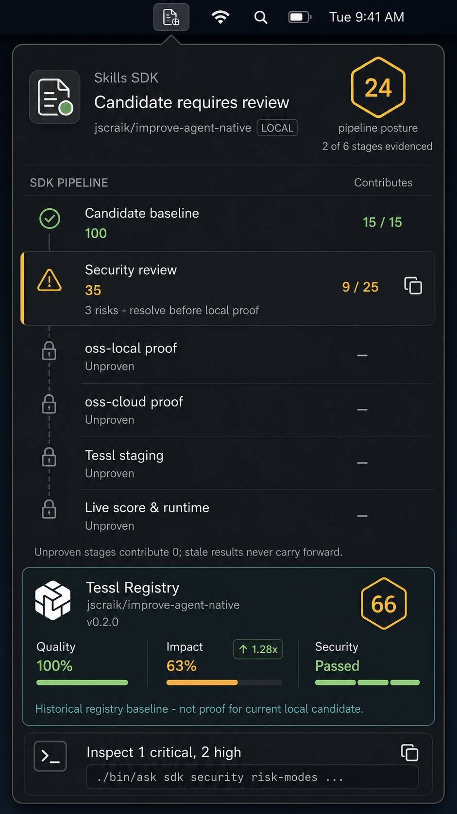

# SkillsBar Pipeline Posture

## Command Summary

Make the selected pipeline-posture mockup the default SkillsBar experience.
The app shows a local Skill SDK candidate progressing through sequential,
evidence-backed gates. It must make the active blocker, held observations, and
the next inspection action obvious. Tessl remains visually recognisable but its
provenance changes the card: live CLI data is a current registry observation;
cached data is a historical external baseline. Neither certifies package
identity for the changed local candidate.

The retained visual reference is:



This image guides hierarchy, custom icons, score display, density, and color
semantics. The requirements below are authoritative when the image and prose
differ.

## Product Contract

### Primary Job

Help a Skill SDK maintainer answer, in one glance:

1. What stage is the current local candidate in?
2. What evidence is current for that candidate?
3. What specific finding must be improved before progress can continue?
4. Is the Tessl comparison live or historical, and what does it actually prove?

SkillsBar is a visual guide for local SDK work. It is not a publication control,
an automatic repair agent, or an authorization engine.

### Evidence Boundaries

- A current local candidate is identified by a fingerprint over governed inputs:
  `SKILL.md`, core references, package identity, scenario set, criteria, rubric,
  scorer, and declared model profile.
- Any governed-input change supersedes active proof for that candidate. The
  display returns to the first stage and shows later proof as unproven until it
  is re-established for the new fingerprint.
- A successful current Tessl CLI search is labelled live. Its declared-version
  comparison remains distinct from canonical package identity.
- When the Tessl CLI is unavailable, the last successful registry observation
  may be shown from a local sanitized cache, but it is labelled historical and
  is never treated as proof for the candidate.
- Local package shape, security, `oss-local`, `oss-cloud`, Tessl staging, live
  Tessl scoring, and runtime observation remain distinct evidence lanes.
- A later lane cannot mask an earlier unproven or failed lane.

## Nine-Gate Presentation

The app exposes the canonical SDK lifecycle as nine strict, scan-friendly gates.

| Order | Visible gate | SDK evidence represented |
| --- | --- | --- |
| 1 | Candidate identity | canonical package digest and SDK entry receipt |
| 2 | Mechanical validation | package verification plus strict audit |
| 3 | Security & guardrails | risk taxonomy plus the full governed security receipt |
| 4 | Eval preparation | scenario readiness, scorer, and calibration |
| 5 | Eval local proof | fixed scenarios under the `oss-local` profile |
| 6 | Eval cloud proof | the same scenario identities under the `oss-cloud` profile |
| 7 | Tessl staging | local proof, dry run, and handoff |
| 8 | Tessl live & registry | live confirmation and registry visibility |
| 9 | Runtime truth | installed digest, doctor output, and observed behavior |

The ordered gates are strict. An early observation can remain visible as
**Held** without promoting a downstream gate. Missing later evidence is
**Unproven** and uses a lock, not a failure treatment. A governed-input change
makes mismatched receipts stale.

The header uses a numbered current-gate ring rather than a weighted readiness
score. It also states how many receipts are current for the candidate. In the
approved state, gate 1 is active, one candidate-bound receipt is current, and
all downstream proof is held.

## Visual Requirements

### Header

- Show the custom Skills SDK document icon from `SkillsSDKIcon.png` in the
  header source treatment. Do not replace it with a generic document glyph.
- Use `Evidence needs attention` while a current gate is active.
- Show the selected package, a `LOCAL` source label, and declared local version.
- Show the gate number in an amber current-gate ring with its visible gate name.
- State `<n> receipt current · downstream proof held`; do not replace this with
  a readiness percentage or local aggregate score.

### Pipeline

- Present the nine gates in order with a stable trailing status column.
- Use a green check only for a current passed stage.
- Give the active blocked or review gate a restrained amber leading indicator,
  numbered marker, concrete blocker copy, and `ACTION` trailing label.
- Use muted lock/clock semantics for later unproven stages. They must not look
  red or failed.
- Show `1 / 2` for partial mechanical evidence, `HELD` for early observations
  that cannot promote, and an em dash for unreached gates.
- State: `A held observation cannot promote a downstream gate.`
- Do not introduce generic feature-tour copy, hidden remediation, or automatic
  terminal execution.

### Tessl Registry Evidence

- Use the custom Tessl cube asset from `TesslLogo.png`. Do not replace it with
  a generic package or box symbol.
- Label the panel `Tessl Registry` and render the package/version from the
  external registry data.
- Preserve Tessl's recognizable score language inside the secondary panel:
  amber outlined hex score, green Quality and Security indicators, amber Impact
  indicator, and a green `1.28x` lift badge when the registry provides it.
- A restrained teal/cyan perimeter and text accent identify the Tessl source;
  teal is not a local pass color.
- When authenticated Tessl CLI search returns a registry version, compare it
  with the selected local skill's declared version. A version match MUST remain
  explicit that package identity is unverified because the current registry
  search payload does not expose a shared package digest.
- For a live version match, render:
  `Live Tessl registry · version matches local candidate; package identity unverified.`
- For a live version mismatch, render both versions and state that they differ.
- When a live response omits its version, render:
  `Live Tessl registry data · candidate identity not verified.`
- When the Tessl CLI is unavailable, show a `CLI UNAVAILABLE` badge and the
  sanitized last-known registry snapshot when one exists. Render:
  `Historical external baseline · not proof for this candidate.`
- Cached Quality, Impact, Security, score, and version are visually muted and
  labelled `LAST KNOWN REGISTRY DATA`; they remain historical observations.
- When the CLI exists but authentication or registry search is blocked, render:
  `Registry comparison unavailable · not proof for this candidate.`
- Registry-version equality MUST NOT be treated as package-digest equality,
  installed-runtime proof, or proof of unpublished local edits.
- The registry card is secondary to the local active gate. Its score and
  metrics never promote the local gate sequence.

### Action

- Place one compact next-action surface after the evidence cards.
- The action is owned by the active gate. For candidate identity, show
  `Establish canonical identity` and copy the full `./bin/ask sdk start ...
  --json --robot` command.
- The copy control is icon-only, has a clear tooltip and accessible name, and
  copies the full command even when the preview is visually shortened.
- Keep the terminal glyph, action text, and command preview calm and neutral;
  do not style this action as an amber warning panel.

### Apple-Design Constraints

- Retain the native `MenuBarExtra(.window)` shell and its anchored relationship
  to the menu bar.
- Use restrained graphite material, a fine boundary, system typography, and
  stable row geometry. Do not add a normal application window, dashboard
  navigation, decorative gradients, or speculative motion.
- Treat motion as optional and native-led. If custom motion is added, use a
  critically damped, non-bouncy transition and use an opacity/material
  alternative for reduced-motion users.
- The active-stage action receives immediate pointer and keyboard feedback;
  accessibility focus is visible and not amber.

## Data Contract

The next implementation must add an explicit model rather than infer stages
from the existing independent snapshot fields.

```text
PipelineCandidate
  fingerprint
  governedInputPaths
  observedAt
  stageReceipts[]
  evidencedStageCount

PipelineStageReceipt
  stage
  candidateFingerprint
  evidenceStatus: passed | review_required | blocked | held | unproven | stale
  stageScore: 0...100 | null
  contribution: 0...weight
  command
  receiptPath
  modelProfile
  observedAt
  nextAction

TesslRegistrySnapshot
  version
  score
  quality
  impact
  security
  lift
  runOrRegistryReference
  observedAt
  provenance: cached_historical

TesslRegistryComparison
  dataOrigin: live_cli | cached | fixture | unavailable
  localDeclaredVersion
  registryVersion
  relation: version_match | version_mismatch | identity_unverified | unavailable
  packageIdentityVerified: false
```

The implementation must not fabricate `oss-local`, `oss-cloud`, Tessl staging,
or live-score receipts from the existing `scenario-quality` preview result.
Missing evidence remains unproven.

## Acceptance Criteria

- AC-001: A local candidate fingerprint is visible in the model and invalidates
  active stage receipts when a governed input changes.
- AC-002: The nine gates render in the exact order defined above and the header
  ring names the first active gate.
- AC-003: Candidate identity precedes mechanical, security, preparation, and
  eval proof; observed downstream signals remain Held until earlier gates pass.
- AC-004: The custom Skills SDK and Tessl icons are used in their source rows.
- AC-005: The Tessl card preserves its score, Quality, Impact, Security, and
  lift language while showing the provenance-aware live comparison or the
  historical-not-proof fallback defined above.
- AC-006: Tessl cached historical data does not promote the local gate sequence.
- AC-007: The active stage exposes a single evidence-backed copy action whose
  visual preview and pasteboard value use the same command source.
- AC-008: The app renders a deterministic pipeline-posture fixture matching the
  approved visual hierarchy without claiming it is a live MenuBarExtra proof.
- AC-009: Accessibility, reduced-transparency, increased-contrast, and small
  visible-frame behavior are checked against the implemented surface.

## Implementation Boundary

The direct user request dated 2026-07-14 authorizes this bounded SwiftUI,
pipeline-model, sanitized-cache, and test update in the canonical checkout. It
does not authorize packaging, signing, notarization, publication, commit, push,
or claims about Tessl registry freshness beyond the observed CLI response.

## Proof Boundary

This document and the retained mockup prove only the selected design contract.
Repository validation may separately prove local compilation, tests, snapshot
rendering, and process launch. It does not prove Tessl authentication or
registry freshness in a different session, package-digest equality, installed
runtime behavior, publication, notarization, or release readiness.
